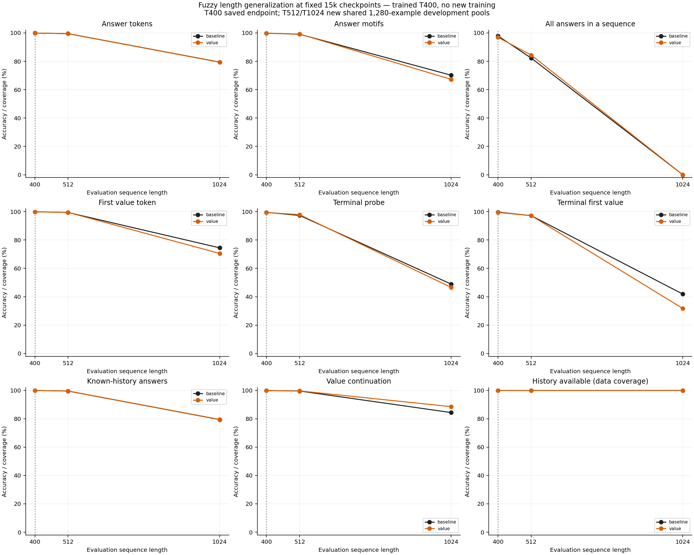
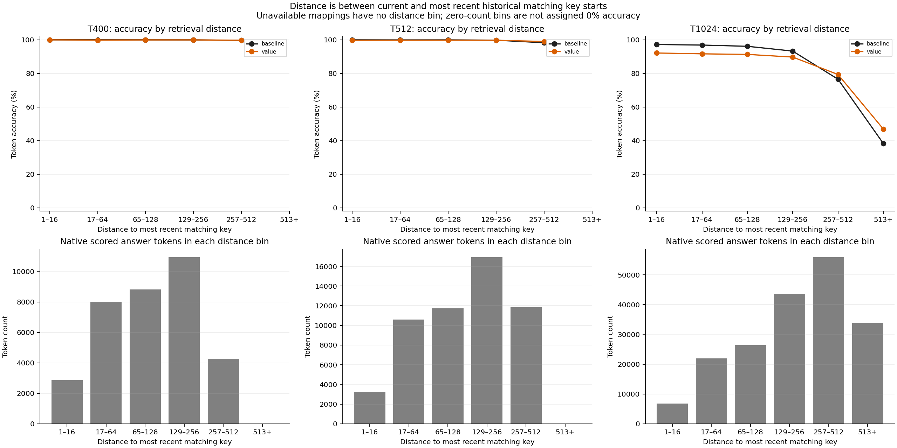
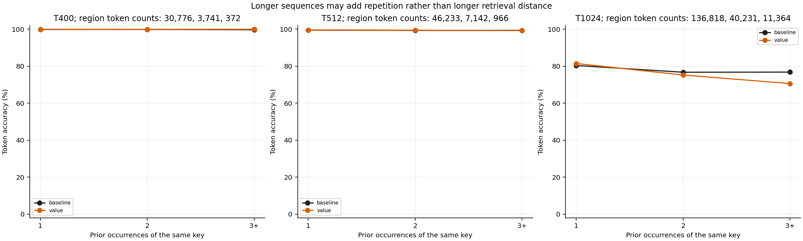

# Value-route versus baseline: Fuzzy length generalization

Two fixed 15,000-update checkpoints: uninjected baseline and upper-layer permanent-value addition v_t = W_V h_t + 0.01 P_e e_t. Both trained on mixed A5 T12/Fuzzy T400 with NextLat, paired initial shared tensors, identical ordered data and optimization. The value route adds 16,384 parameters. T400 metrics come from the saved training endpoints. T512/T1024 use the same held-out pools of 1,280 examples; baseline measurements are reused from the verified earlier probe. This tests length generalization, not training at longer lengths. More tokens can add repeated mappings as well as longer retrieval distances. Single-seed development results do not establish a replicated architectural effect or reveal how the baseline represents embeddings. No training, final confirmation, A5 re-evaluation or autonomous latent rollout is performed.

| Arm | Length | Answer | First value | Terminal | Terminal first | Motif exact | Sequence exact |
| --- | ---: | ---: | ---: | ---: | ---: | ---: | ---: |
| baseline | 400 | 99.9112% | 99.9256% | 99.5272% | 99.6875% | 99.8397% | 97.8906% |
| baseline | 512 | 99.4959% | 99.4326% | 97.3277% | 97.1875% | 99.0812% | 82.2656% |
| baseline | 1024 | 79.4008% | 74.4914% | 48.9054% | 41.8750% | 70.1713% | 0.0000% |
| value | 400 | 99.8682% | 99.9084% | 99.4090% | 99.4531% | 99.7596% | 96.8750% |
| value | 512 | 99.5658% | 99.4912% | 97.8699% | 97.1875% | 99.1983% | 84.3750% |
| value | 1024 | 79.4942% | 70.5474% | 46.5598% | 31.7188% | 67.2487% | 0.0000% |

## Value minus baseline

Differences are percentage points at the fixed endpoints, not best-checkpoint selections.

| Length | Answer | First value | Terminal | Terminal first | Motif exact | Sequence exact |
| --- | ---: | ---: | ---: | ---: | ---: | ---: |
| 400 | -0.0430 | -0.0172 | -0.1182 | -0.2344 | -0.0801 | -1.0156 |
| 512 | +0.0699 | +0.0586 | +0.5422 | +0.0000 | +0.1171 | +2.1094 |
| 1024 | +0.0934 | -3.9441 | -2.3456 | -10.1562 | -2.9227 | +0.0000 |

Near-zero sequence exactness is a floor and near-perfect answer accuracy is a ceiling. Interpret first-value, terminal, known-history and distance-bin results alongside them. A change in this aggregate outcome cannot identify the baseline's internal mechanism or rule out other embedding routes, gains or initialization seeds.

Evaluation microbatch 64, FP32 eager, no TF32/autocast/compile/CUDA graphs. All longer-length scoring populations are identical between arms. The baseline cache is bound to its original report, checkpoint, data and frozen source hashes; its reconstructed checkpoint tensor digest matches the earlier probe. The value model and all executed source/data hashes are checked before and after evaluation. Native teacher-conditioned NextLat diagnostics are retained; no latent rollout occurs.

- baseline: checkpoint `5db99243133937d9eb2fc1dd7c1815d228262d974e7dfd23336aed0d11aa7d6b`; 479,616 parameters.
- value: checkpoint `5260a87446b33a0e59e8bb48b0ffe3d0ac51cc523bb16eed0a9b9c150f7d1c91`; 496,000 parameters.

Data manifest SHA256: `b27a1811dee0ede42777186be8aa55c3b060166e6164d8ee933a0ac00dcac5fe`.

[PDF](fuzzy-length-generalization.pdf)

[PDF](fuzzy-retrieval-distance.pdf)

[PDF](fuzzy-prior-occurrences.pdf)
