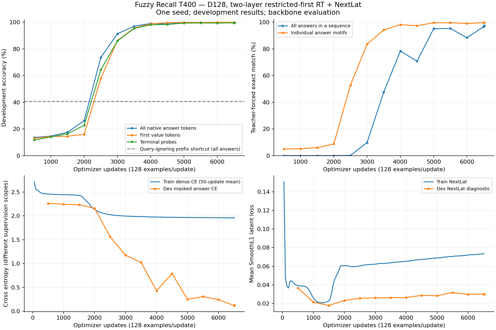
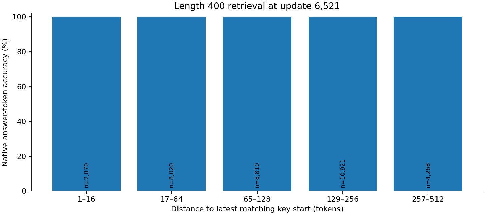

# Width-128 Fuzzy Recall pilot

Completed 6,521 updates on native MAD Fuzzy Recall at sequence length 400.

Two RT layers: first window two, second full recurrent. D128/H16/GELU FFN512; Mitchell, ALiBi, FP32 eager; NextLat predictor hidden128, weight one. 479,616 total training parameters. No embedding bypass.

Logical batch128, LR1e-4, 834,688 examples; 12,800 train and 1,280 development examples. One seed; final confirmation remains unevaluated.

| Development metric | Endpoint |
| --- | ---: |
| Native answer tokens | 99.885% |
| First value tokens | 99.954% |
| Terminal probe tokens | 99.567% |
| Answer motifs exact | 99.811% |
| All answers in a sequence exact | 97.578% |

Query-ignoring answer-prefix shortcut: 40.637% on the same native answer positions. Uniform value-token chance is12.5%.
Causal lookup availability: 99.9771%; this is not a universal statistical ceiling.

Training CE includes all native positions; development CE scores recall answers. These losses have different scopes. Exact match is teacher-forced, not autonomous generation.

Checkpoint: step-006521.pt; SHA256 `afeb822e2b0fba636b1e5d95b72d1a3a3606cdfb6a9737f2d982a38bc80d9c6a`.

[Training W&B](https://wandb.ai/taylorbollman/rt-nextlat-fuzzy-a5/runs/wrfaw42j)

Stop for review before A5, joint training, other widths or additional sequence lengths.
