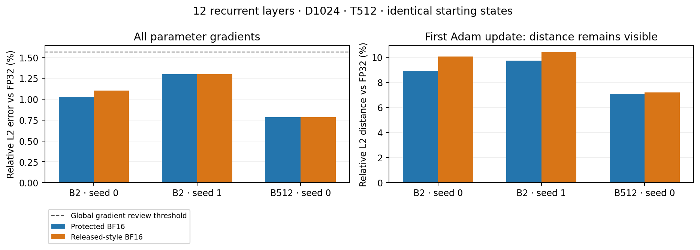
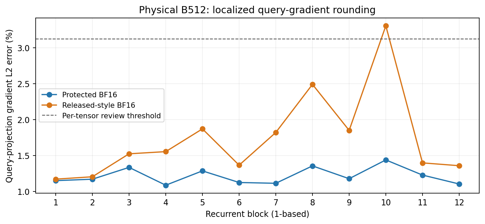
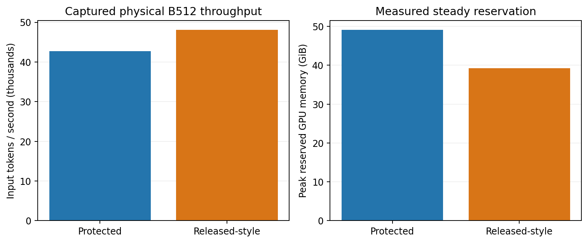

# Initial standard RT precision evidence

Status: numerical/replay gates complete; paired real-C4 warmup training underway.
This is an intermediate report, not a final precision-policy recommendation.
Execution lineage: `.runtime/rt-precision-alignment/20260910T191100Z`.

The model is twelve tiled recurrent blocks, D1024/H16/FFN4096, rho 1, causal
ALiBi and learned Q/K normalization, with 151,045,120 backbone and 216,843,264
total parameters. CDRM is disabled. The training shape is physical B512/T512;
head-only microbatching is 2 and internal backward MLP recomputation uses four
chunks. All three arms keep FP32 master parameters, gradients and Adam state.

A uses our protected BF16 policy, B uses the released-style mixed precision,
and C is physical-batch tiled FP32 with autocast/TF32 disabled. Native shifted
CE uses 511 targets per row and a B×512 denominator. Each case starts with the
same exact weights, inputs and empty Adam state across arms. The two full-B2
initializations use seeds 20260910 and 20260911; B512 uses the first seed's
retained initial weights. A/B/C diagnostic updates use LR0.001, explicitly a
numerical probe rather than the first warmup update.

## What passed

The released-style path passed tiny and full-width B2 captured-versus-uncaptured
checks: repeated gradients, three changed-input Adam updates, model state and
causality. Initial loss and all 111 gradient tensors matched bitwise at physical
B512 too. Every completed numerical case retained finite FP32 parameters,
gradients and Adam moments; no fallback or source-integrity failure was hidden.

The tiny terminal-output test found nonzero credit for every earlier recurrent
write and zero credit for the terminal write. With each policy's forward held
fixed, multiplying the incoming cotangent by 1/32 or 32 produced bitwise-equal
parameter gradients and write adjoints after rescaling. Observers did not alter
any accepted loss/gradient result. This is a bounded structural/linearity
check, not a whole-model FP64 oracle or a task-performance claim.

## Precision review flags retained

The global/tensor L2 review thresholds are 1.5625%/3.125%; the per-tensor
maximum-error threshold is 6.25% of that tensor's reference maximum. Metrics
use all coordinates and FP64 reductions, without an absolute acceptance floor.
These are our prospective investigation thresholds, not the authors' published
tolerances. Initial Adam cosine >=0.99 is a review screen; sizeable update
vector distances remain reported.

| Case | BF16 arm vs C | Global gradient L2 error | Flagged tensors | Adam delta L2 distance | Adam cosine |
| --- | --- | ---: | ---: | ---: | ---: |
| tiny-seed0 | A | 1.4228% | 0 | 13.427% | 0.990986 |
| tiny-seed0 | B | 1.5187% | 0 | 14.079% | 0.990089 |
| full-b2-seed0 | A | 1.0279% | 0 | 8.912% | 0.996029 |
| full-b2-seed0 | B | 1.1033% | 21 | 10.061% | 0.994939 |
| full-b2-seed1 | A | 1.2995% | 0 | 9.725% | 0.995272 |
| full-b2-seed1 | B | 1.3024% | 18 | 10.395% | 0.994597 |
| full-b512-seed0 | A | 0.7873% | 0 | 7.060% | 0.997508 |
| full-b512-seed0 | B | 0.7874% | 3 | 7.203% | 0.997406 |

Full B2 legacy flags concentrate in query projections and learned Q/K norms;
flagged tensor errors reach about 4.3%. At B512 only block9's query projection
and two Q/K normalization tensors cross the 3.125% L2 screen, at roughly
3.31–3.34%. Every B512 maximum-error screen passes. The protected A arm has
no tensor review flags in these initial cases. These scoped findings support
further testing; they do not establish exact optimizer updates or long-term
training equivalence.

The actual physical B512 FP32 reference fit: peak allocated 45.81 GiB,
peak reserved 61.41 GiB. No reference microbatch approximation was needed.

## Localizing the discrepancy

A separate block9/B2 probe exactly reproduced the retained legacy loss and all
parameter gradients, then froze its rounded Q/K/V operands and actual incoming
attention gradient. Its independent causal-attention FP64 derivative showed
4.3098% L2 error in the legacy query adjoint. FP32 attention math on the same
operands had 0.0000782% error. This establishes a local backward-arithmetic
contribution; earlier forward drift alone does not explain that contribution.
It does not isolate one primitive or validate a production FP32-backward-only
policy.

The reconstructed probabilities and attention differed from conditional FP64
by about 0.215% and 0.233%, respectively. Attention derivatives depend on
weighted differences between values and attended values, so rounding can have
more relative effect on derivatives than on outputs. This is a mechanism to
investigate, not an attribution of every parameter error to one operation.
The first-query self-only identities passed exactly: no observed spurious Q/K
credit at token0. A proposed token0 cancellation explanation was rejected for
this measured case.

## Cost and next gate

The released-style B512 CUDA-graph profile averaged 5.454 s/update
(48,064 input tokens/s), reserving 39.23 GiB. The preceding protected profile
averaged 6.139 s/update and reserved 49.07 GiB. That is approximately 12.6%
higher throughput and 9.85 GiB less reservation, using the earlier same-machine
control. It is a bounded profile, not a randomized performance study.

The same figures are available in the
[W&B numerical report](https://wandb.ai/taylorbollman/rt-precision-alignment/runs/6hjh7ayk).

The guarded real-C4 pair starts with 100 updates under the exact released
5,000-update warmup, alpha0=0.1, alpha_f=0.1 and 12,500-update horizon. The
peak LR remains0.001; update1 uses0.00010018 and update100 uses0.000118.
Compatible checkpoints and the retained compiler cache support the conditional
500-update continuation. Common-FP32 held-out evaluation will distinguish
trained-weight differences from native evaluation rounding. A short warmup
prefix cannot clear peak-LR behavior or long-term convergence.

The protected default remains in place. Earlier ownership, autocast restoration,
masking and capture fixes remain; no core model arithmetic has been changed in
this milestone. See [change audit](change-audit.md),
[initial evidence audit](initial-evidence-audit.md), and
[usage](../../rt-precision-alignment-usage.md).

Online runs: [W&B project](https://wandb.ai/taylorbollman/rt-precision-alignment).
Reusable data and completed numerical packets are being hash-verified at
`gs://fast-chunks/cdrm-w-latent/rt-precision-alignment/20260910T191100Z/`;
per-case storage receipts distinguish completed uploads from pending work.
