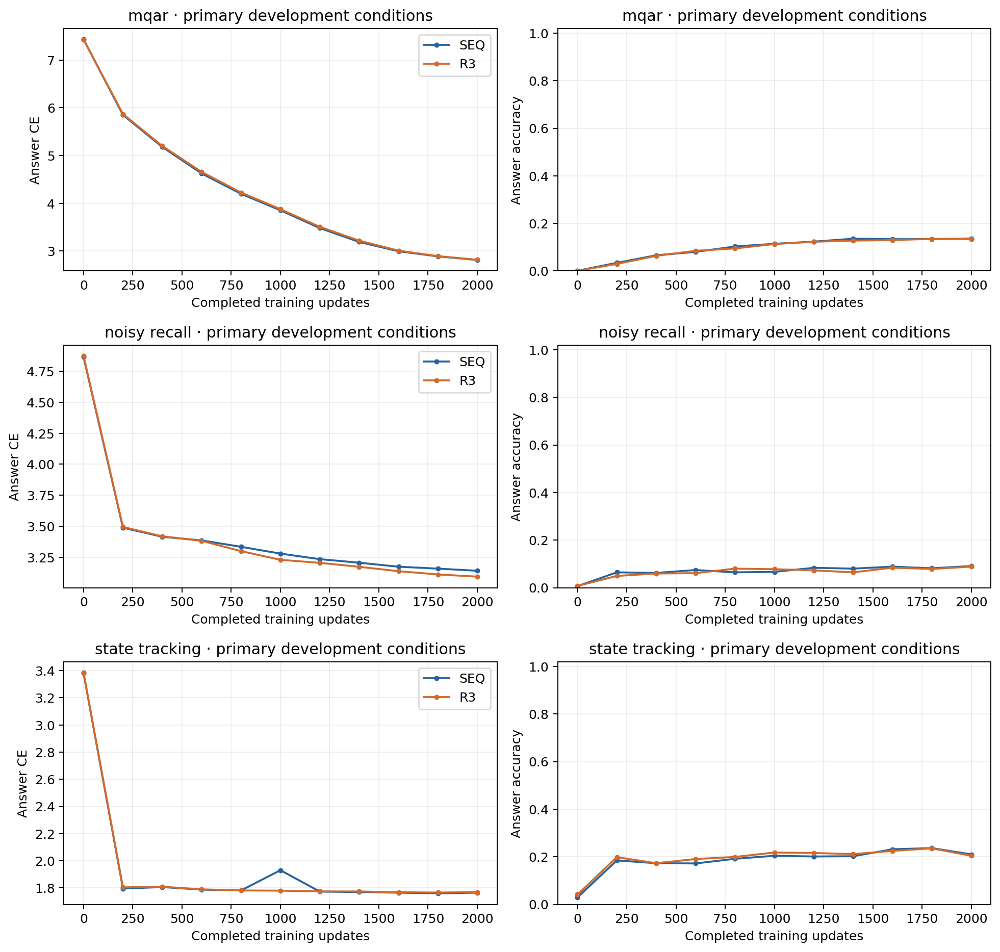
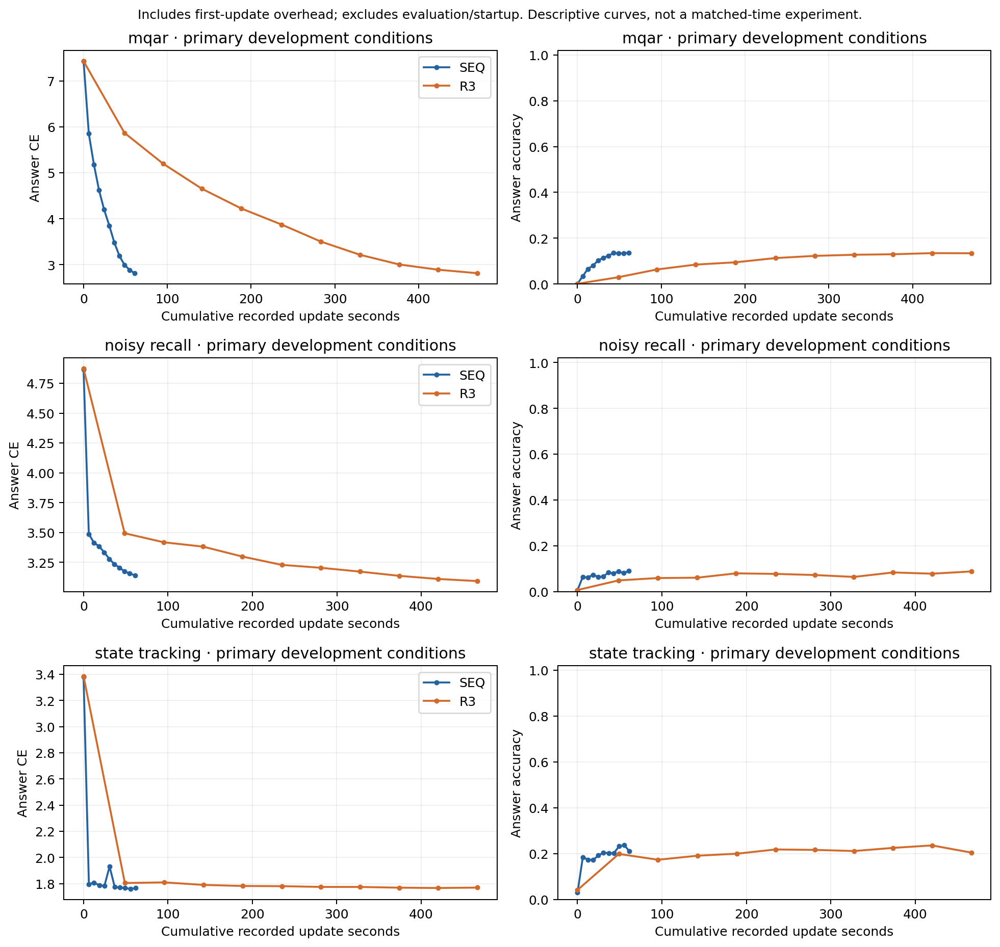
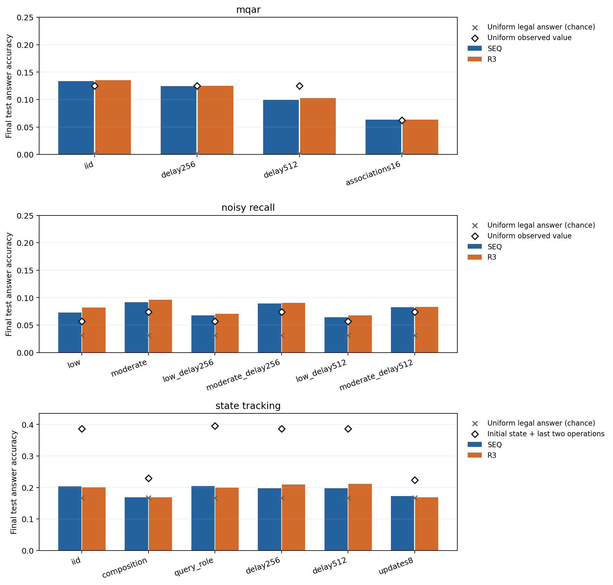

# Stage B paired synthetic pilot

This is a single-seed exploratory comparison (training seed 0) of SEQ and R3 after 2,000 updates per arm. Each final condition uses 4,096 fixed held-out examples. Corresponding initialization and every training batch are paired; R3 uses rho=1 from initialization.

Intervals use 2,000 paired bootstrap resamples of whole examples. They describe test-example variation conditional on this trained pair, exclude training-seed uncertainty, and have no adjustment for the multiple reported conditions. No automatic architectural win is inferred. Answer accuracy and CE use only designated answers; sequence accuracy requires every answer in an example to be correct.

When neither arm has any all-correct example, the empirical paired bootstrap produces a degenerate [0, 0] interval for the sequence-accuracy difference. This reflects zero observed successes and does not establish equality of population sequence accuracies.

Training uses fp32 with the frozen plan's model and optimizer settings. These are small symbolic models, not pretrained language-model checkpoints. The state composition holdout tests an unseen ordered operation pattern; finite compositions can still implement a function seen in training.

[Machine-readable report and complete artifact hashes](report.json) · [Development curves (PDF)](development-learning-curves.pdf) · [Development versus recorded update time (PDF)](development-update-time-curves.pdf) · [Final accuracy figure (PDF)](final-condition-accuracy.pdf)

The time-axis curves below use cumulative recorded update seconds through each development evaluation. They include first-update overhead, exclude evaluation and startup, and are descriptive curves rather than an end-to-end matched-time experiment. No matched-time extrapolation is performed.

## mqar

| Condition | SEQ answer | R3 answer | SEQ sequence | R3 sequence | SEQ CE | R3 CE |
|---|---:|---:|---:|---:|---:|---:|
| iid | 13.35% | 13.57% | 0.00% | 0.00% | 2.8198 | 2.8220 |
| delay256 | 12.45% | 12.54% | 0.00% | 0.00% | 3.0582 | 3.0689 |
| delay512 | 9.92% | 10.26% | 0.00% | 0.00% | 4.1864 | 4.1714 |
| associations16 | 6.34% | 6.32% | 0.00% | 0.00% | 5.8457 | 5.8165 |

Differences below are **R3 minus SEQ**, with paired 95% intervals. Accuracy differences are percentage points; lower CE is better.

| Condition | Answer difference | Sequence difference | CE difference |
|---|---:|---:|---:|
| iid | +0.214 pp [-0.098, +0.519] | +0.000 pp [+0.000, +0.000] | +0.002 [-0.006, +0.011] |
| delay256 | +0.092 pp [-0.183, +0.360] | +0.000 pp [+0.000, +0.000] | +0.011 [-0.000, +0.020] |
| delay512 | +0.345 pp [+0.061, +0.620] | +0.000 pp [+0.000, +0.000] | -0.015 [-0.031, +0.002] |
| associations16 | -0.017 pp [-0.136, +0.105] | +0.000 pp [+0.000, +0.000] | -0.029 [-0.040, -0.018] |

Measured or analytically defined shortcut baselines on these same test fixtures:

| Condition | Baseline | Answer accuracy |
|---|---|---:|
| iid | Uniform legal answer | 0.20% |
| iid | Uniform observed value | 12.50% |
| iid | Last record value | 12.50% |
| iid | Restricted history, uniform fallback | 32.62% |
| delay256 | Uniform legal answer | 0.20% |
| delay256 | Uniform observed value | 12.50% |
| delay256 | Last record value | 12.50% |
| delay256 | Restricted history, uniform fallback | 0.20% |
| delay512 | Uniform legal answer | 0.20% |
| delay512 | Uniform observed value | 12.50% |
| delay512 | Last record value | 12.50% |
| delay512 | Restricted history, uniform fallback | 0.20% |
| associations16 | Uniform legal answer | 0.20% |
| associations16 | Uniform observed value | 6.25% |
| associations16 | Last record value | 6.25% |
| associations16 | Restricted history, uniform fallback | 6.66% |

Best-development selection uses the unweighted mean answer CE over iid. Final-checkpoint results above remain primary.

## noisy recall

| Condition | SEQ answer | R3 answer | SEQ sequence | R3 sequence | SEQ CE | R3 CE |
|---|---:|---:|---:|---:|---:|---:|
| low | 7.30% | 8.18% | 7.30% | 8.18% | 3.2262 | 3.1714 |
| moderate | 9.16% | 9.64% | 9.16% | 9.64% | 3.0936 | 3.0317 |
| low_delay256 | 6.76% | 7.06% | 6.76% | 7.06% | 3.2737 | 3.2378 |
| moderate_delay256 | 8.96% | 9.03% | 8.96% | 9.03% | 3.1459 | 3.1037 |
| low_delay512 | 6.40% | 6.79% | 6.40% | 6.79% | 3.3924 | 3.4268 |
| moderate_delay512 | 8.25% | 8.33% | 8.25% | 8.33% | 3.3094 | 3.3407 |

Differences below are **R3 minus SEQ**, with paired 95% intervals. Accuracy differences are percentage points; lower CE is better.

| Condition | Answer difference | Sequence difference | CE difference |
|---|---:|---:|---:|
| low | +0.879 pp [-0.098, +1.929] | +0.879 pp [-0.098, +1.929] | -0.055 [-0.069, -0.041] |
| moderate | +0.488 pp [-0.635, +1.489] | +0.488 pp [-0.635, +1.489] | -0.062 [-0.079, -0.045] |
| low_delay256 | +0.293 pp [-0.709, +1.368] | +0.293 pp [-0.709, +1.368] | -0.036 [-0.054, -0.017] |
| moderate_delay256 | +0.073 pp [-1.074, +1.245] | +0.073 pp [-1.074, +1.245] | -0.042 [-0.063, -0.021] |
| low_delay512 | +0.391 pp [-0.635, +1.392] | +0.391 pp [-0.635, +1.392] | +0.034 [+0.008, +0.060] |
| moderate_delay512 | +0.073 pp [-1.123, +1.172] | +0.073 pp [-1.123, +1.172] | +0.031 [+0.002, +0.061] |

Measured or analytically defined shortcut baselines on these same test fixtures:

| Condition | Baseline | Answer accuracy |
|---|---|---:|
| low | Uniform legal answer | 3.12% |
| low | Uniform observed value | 5.70% |
| low | Last record value | 7.01% |
| low | Restricted history, uniform fallback | 24.46% |
| moderate | Uniform legal answer | 3.12% |
| moderate | Uniform observed value | 7.42% |
| moderate | Last record value | 8.67% |
| moderate | Restricted history, uniform fallback | 18.38% |
| low_delay256 | Uniform legal answer | 3.12% |
| low_delay256 | Uniform observed value | 5.70% |
| low_delay256 | Last record value | 7.01% |
| low_delay256 | Restricted history, uniform fallback | 3.12% |
| moderate_delay256 | Uniform legal answer | 3.12% |
| moderate_delay256 | Uniform observed value | 7.42% |
| moderate_delay256 | Last record value | 8.67% |
| moderate_delay256 | Restricted history, uniform fallback | 3.12% |
| low_delay512 | Uniform legal answer | 3.12% |
| low_delay512 | Uniform observed value | 5.70% |
| low_delay512 | Last record value | 7.01% |
| low_delay512 | Restricted history, uniform fallback | 3.12% |
| moderate_delay512 | Uniform legal answer | 3.12% |
| moderate_delay512 | Uniform observed value | 7.42% |
| moderate_delay512 | Last record value | 8.67% |
| moderate_delay512 | Restricted history, uniform fallback | 3.12% |

Best-development selection uses the unweighted mean answer CE over low, moderate. Final-checkpoint results above remain primary.

## state tracking

| Condition | SEQ answer | R3 answer | SEQ sequence | R3 sequence | SEQ CE | R3 CE |
|---|---:|---:|---:|---:|---:|---:|
| iid | 20.34% | 20.07% | 20.34% | 20.07% | 1.7654 | 1.7673 |
| composition | 16.92% | 16.89% | 16.92% | 16.89% | 1.8183 | 1.8201 |
| query_role | 20.46% | 19.95% | 20.46% | 19.95% | 1.7654 | 1.7682 |
| delay256 | 19.80% | 20.95% | 19.80% | 20.95% | 1.7670 | 1.7690 |
| delay512 | 19.80% | 21.17% | 19.80% | 21.17% | 1.7674 | 1.7697 |
| updates8 | 17.29% | 16.85% | 17.29% | 16.85% | 1.7985 | 1.8001 |

Differences below are **R3 minus SEQ**, with paired 95% intervals. Accuracy differences are percentage points; lower CE is better.

| Condition | Answer difference | Sequence difference | CE difference |
|---|---:|---:|---:|
| iid | -0.269 pp [-1.270, +0.708] | -0.269 pp [-1.270, +0.708] | +0.002 [-0.001, +0.004] |
| composition | -0.024 pp [-0.903, +0.855] | -0.024 pp [-0.903, +0.855] | +0.002 [-0.000, +0.004] |
| query_role | -0.513 pp [-1.416, +0.416] | -0.513 pp [-1.416, +0.416] | +0.003 [+0.001, +0.005] |
| delay256 | +1.147 pp [+0.146, +2.197] | +1.147 pp [+0.146, +2.197] | +0.002 [-0.002, +0.006] |
| delay512 | +1.367 pp [+0.146, +2.588] | +1.367 pp [+0.146, +2.588] | +0.002 [-0.003, +0.007] |
| updates8 | -0.439 pp [-1.367, +0.488] | -0.439 pp [-1.367, +0.488] | +0.002 [-0.001, +0.004] |

Measured or analytically defined shortcut baselines on these same test fixtures:

| Condition | Baseline | Answer accuracy |
|---|---|---:|
| iid | Uniform legal answer | 16.67% |
| iid | Initial state only | 26.03% |
| iid | Initial state plus last operation | 5.98% |
| iid | Initial state plus last two operations | 38.65% |
| composition | Uniform legal answer | 16.67% |
| composition | Initial state only | 16.70% |
| composition | Initial state plus last operation | 10.64% |
| composition | Initial state plus last two operations | 22.92% |
| query_role | Uniform legal answer | 16.67% |
| query_role | Initial state only | 26.07% |
| query_role | Initial state plus last operation | 6.01% |
| query_role | Initial state plus last two operations | 39.58% |
| delay256 | Uniform legal answer | 16.67% |
| delay256 | Initial state only | 26.03% |
| delay256 | Initial state plus last operation | 5.98% |
| delay256 | Initial state plus last two operations | 38.65% |
| delay512 | Uniform legal answer | 16.67% |
| delay512 | Initial state only | 26.03% |
| delay512 | Initial state plus last operation | 5.98% |
| delay512 | Initial state plus last two operations | 38.65% |
| updates8 | Uniform legal answer | 16.67% |
| updates8 | Initial state only | 19.34% |
| updates8 | Initial state plus last operation | 12.62% |
| updates8 | Initial state plus last two operations | 22.39% |

Best-development selection uses the unweighted mean answer CE over iid. Final-checkpoint results above remain primary.

## Training cost and retained checkpoints

Recorded elapsed time includes development evaluation and checkpoint work after startup; it is not pure GPU-kernel time and excludes model construction/fixture loading before the training timer. Update time includes transfer, answer loss, backward, clipping, and AdamW. Generator audits, calibration, separate final evaluation, and earlier NUM/OPS work are outside these counters.

| Task | Arm | Examples | Input tokens | Targets | Update seconds | Recorded elapsed seconds | Best dev update |
|---|---|---:|---:|---:|---:|---:|---:|
| mqar | SEQ | 128,000 | 16,384,000 | 1,024,000 | 61.25 | 87.47 | 2000 |
| mqar | R3 | 128,000 | 16,384,000 | 1,024,000 | 469.97 | 598.76 | 2000 |
| noisy_recall | SEQ | 128,000 | 16,384,000 | 128,000 | 60.87 | 97.15 | 2000 |
| noisy_recall | R3 | 128,000 | 16,384,000 | 128,000 | 466.35 | 671.61 | 2000 |
| state_tracking | SEQ | 128,000 | 16,384,000 | 128,000 | 61.53 | 89.49 | 1800 |
| state_tracking | R3 | 128,000 | 16,384,000 | 128,000 | 466.50 | 618.45 | 1800 |

Every pair was checked for matching source/plan identity, all per-update data hashes, learning rates, and token counts. Final prediction order, gold labels, positions, fixture hashes, and aggregates were checked against the retained arrays. Init, final, best-development, and latest checkpoint bytes were verified against their recorded SHA-256 digests. Full local paths, GCS URIs, hashes, and raw prediction references are in report.json.

Compiled R3 recovery from update 0 is disabled because that cold-start resume path did not pass bitwise validation; fresh initialization and validated midpoint recovery remain available. The pilot uses one microbatch per global batch. A separate R3 accumulation diagnostic passed gradient and optimizer-tensor bounds but failed a parameter-equivalence bound for one embedding element. That unused-path failure is retained, and its cause is not established.

| Task | Arm | Retained checkpoints |
|---|---|---|
| mqar | SEQ | [init](../../../../.runtime/stage-b/20260906T190223Z/runs/SYN-mqar-SEQ-seed0/SYN-mqar-SEQ-seed0-init.pt) · [final](../../../../.runtime/stage-b/20260906T190223Z/runs/SYN-mqar-SEQ-seed0/SYN-mqar-SEQ-seed0-final.pt) · [bestdev](../../../../.runtime/stage-b/20260906T190223Z/runs/SYN-mqar-SEQ-seed0/SYN-mqar-SEQ-seed0-bestdev.pt) · [latest](../../../../.runtime/stage-b/20260906T190223Z/runs/SYN-mqar-SEQ-seed0/SYN-mqar-SEQ-seed0-latest.pt) |
| mqar | R3 | [init](../../../../.runtime/stage-b/20260906T190223Z/runs/SYN-mqar-R3-seed0/SYN-mqar-R3-seed0-init.pt) · [final](../../../../.runtime/stage-b/20260906T190223Z/runs/SYN-mqar-R3-seed0/SYN-mqar-R3-seed0-final.pt) · [bestdev](../../../../.runtime/stage-b/20260906T190223Z/runs/SYN-mqar-R3-seed0/SYN-mqar-R3-seed0-bestdev.pt) · [latest](../../../../.runtime/stage-b/20260906T190223Z/runs/SYN-mqar-R3-seed0/SYN-mqar-R3-seed0-latest.pt) |
| noisy_recall | SEQ | [init](../../../../.runtime/stage-b/20260906T190223Z/runs/SYN-noisy_recall-SEQ-seed0/SYN-noisy_recall-SEQ-seed0-init.pt) · [final](../../../../.runtime/stage-b/20260906T190223Z/runs/SYN-noisy_recall-SEQ-seed0/SYN-noisy_recall-SEQ-seed0-final.pt) · [bestdev](../../../../.runtime/stage-b/20260906T190223Z/runs/SYN-noisy_recall-SEQ-seed0/SYN-noisy_recall-SEQ-seed0-bestdev.pt) · [latest](../../../../.runtime/stage-b/20260906T190223Z/runs/SYN-noisy_recall-SEQ-seed0/SYN-noisy_recall-SEQ-seed0-latest.pt) |
| noisy_recall | R3 | [init](../../../../.runtime/stage-b/20260906T190223Z/runs/SYN-noisy_recall-R3-seed0/SYN-noisy_recall-R3-seed0-init.pt) · [final](../../../../.runtime/stage-b/20260906T190223Z/runs/SYN-noisy_recall-R3-seed0/SYN-noisy_recall-R3-seed0-final.pt) · [bestdev](../../../../.runtime/stage-b/20260906T190223Z/runs/SYN-noisy_recall-R3-seed0/SYN-noisy_recall-R3-seed0-bestdev.pt) · [latest](../../../../.runtime/stage-b/20260906T190223Z/runs/SYN-noisy_recall-R3-seed0/SYN-noisy_recall-R3-seed0-latest.pt) |
| state_tracking | SEQ | [init](../../../../.runtime/stage-b/20260906T190223Z/runs/SYN-state_tracking-SEQ-seed0/SYN-state_tracking-SEQ-seed0-init.pt) · [final](../../../../.runtime/stage-b/20260906T190223Z/runs/SYN-state_tracking-SEQ-seed0/SYN-state_tracking-SEQ-seed0-final.pt) · [bestdev](../../../../.runtime/stage-b/20260906T190223Z/runs/SYN-state_tracking-SEQ-seed0/SYN-state_tracking-SEQ-seed0-bestdev.pt) · [latest](../../../../.runtime/stage-b/20260906T190223Z/runs/SYN-state_tracking-SEQ-seed0/SYN-state_tracking-SEQ-seed0-latest.pt) |
| state_tracking | R3 | [init](../../../../.runtime/stage-b/20260906T190223Z/runs/SYN-state_tracking-R3-seed0/SYN-state_tracking-R3-seed0-init.pt) · [final](../../../../.runtime/stage-b/20260906T190223Z/runs/SYN-state_tracking-R3-seed0/SYN-state_tracking-R3-seed0-final.pt) · [bestdev](../../../../.runtime/stage-b/20260906T190223Z/runs/SYN-state_tracking-R3-seed0/SYN-state_tracking-R3-seed0-bestdev.pt) · [latest](../../../../.runtime/stage-b/20260906T190223Z/runs/SYN-state_tracking-R3-seed0/SYN-state_tracking-R3-seed0-latest.pt) |

Artifact storage prefix: `gs://fast-chunks/cdrm-w-latent/stage-b/20260906T190223Z`. These URI mappings describe the requested archive location; this report does not independently verify cloud upload completion.

The final accuracy panels start at zero and adapt their upper limits to the displayed values. Markers show uniform legal-answer chance and a task-specific shortcut: uniform over observed values for retrieval, or the true initial state followed by only the last two operations for state tracking. These shortcuts use the same final test fixtures as the model bars.

